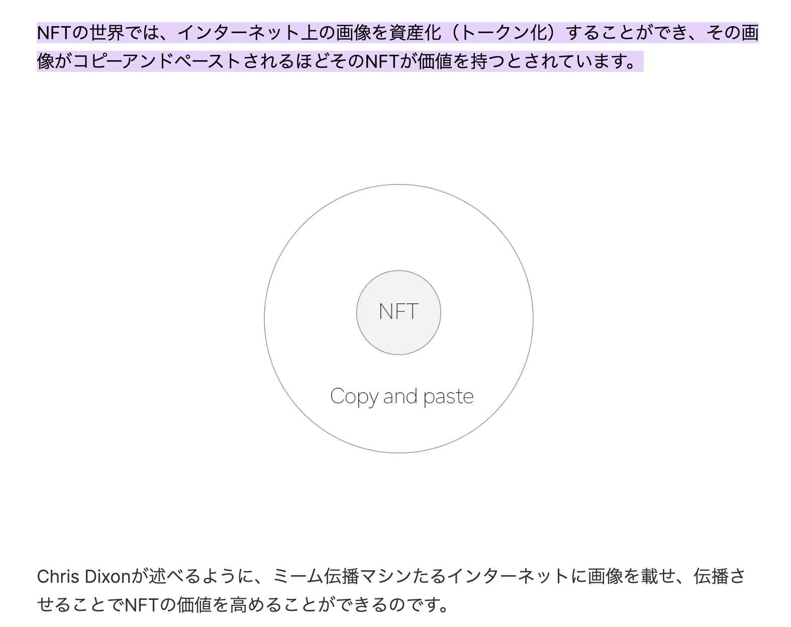

# NFTはコピペされるほど価値が増幅するらしい

作成日時: 2024-03-28 05:19:53
更新日時: 2024-03-31 00:08:28

NFTはコピペされるほど価値が増幅するらしい
ref: [Tokenized Viral]

>インターネットではコピーアンドペーストがあまりに容易であるため、ミームがとてつもない速度で伝播していくというものです。そのミームを面白いと思う気持ちまたは共感が大衆をそうさせます。
> 
> [NFTの世界では、インターネット上の画像を資産化（トークン化）することができ、その画像がコピーアンドペーストされるほどそのNFTが価値を持つとされています。 https://mirror.xyz/zkether.eth/fQAmnnADtuGw9FC_9qcQHD7hV94qtuAW6xSRjaIbWf0#:~:text=NFTの世界では%E3%80%81インターネット上の画像を資産化%EF%BC%88トークン化%EF%BC%89することができ%E3%80%81その画像がコピーアンドペーストされるほどそのNFTが価値を持つとされています%E3%80%82]

