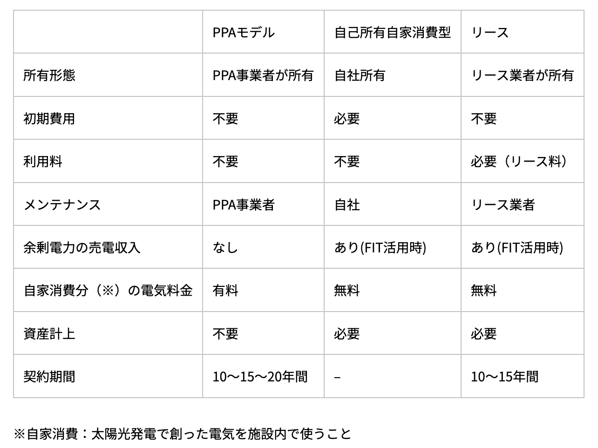
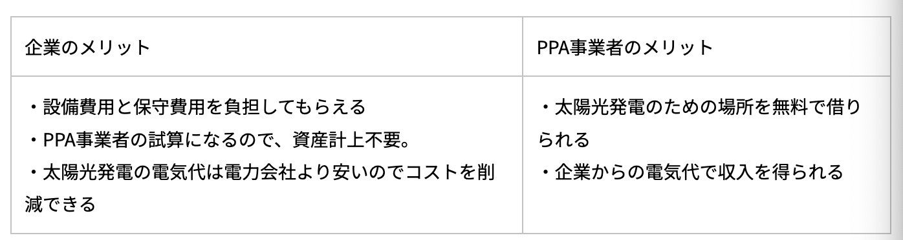

# PPA（電力販売契約）

作成日時: 2024-02-10 09:09:54
更新日時: 2024-02-23 02:39:36

PPA（電力販売契約）
[RE Bridge ｜ 日本初！バーチャルPPA特化型オークションサイト REBridge](https://www.digitalgrid.com/re-bridge/)(https://www.digitalgrid.com/re-bridge/ RE Bridge ｜ 日本初！バーチャルPPA特化型オークションサイト REBridge)
[太陽光発電のPPAモデルとは？仕組みやメリットについて | グリラボ](https://gurilabo.igrid.co.jp/article/1816/)(https://gurilabo.igrid.co.jp/article/1816/ 太陽光発電のPPAモデルとは？仕組みやメリットについて | グリラボ)

 Power Purchase Agreement(電力販売契約）の略称

