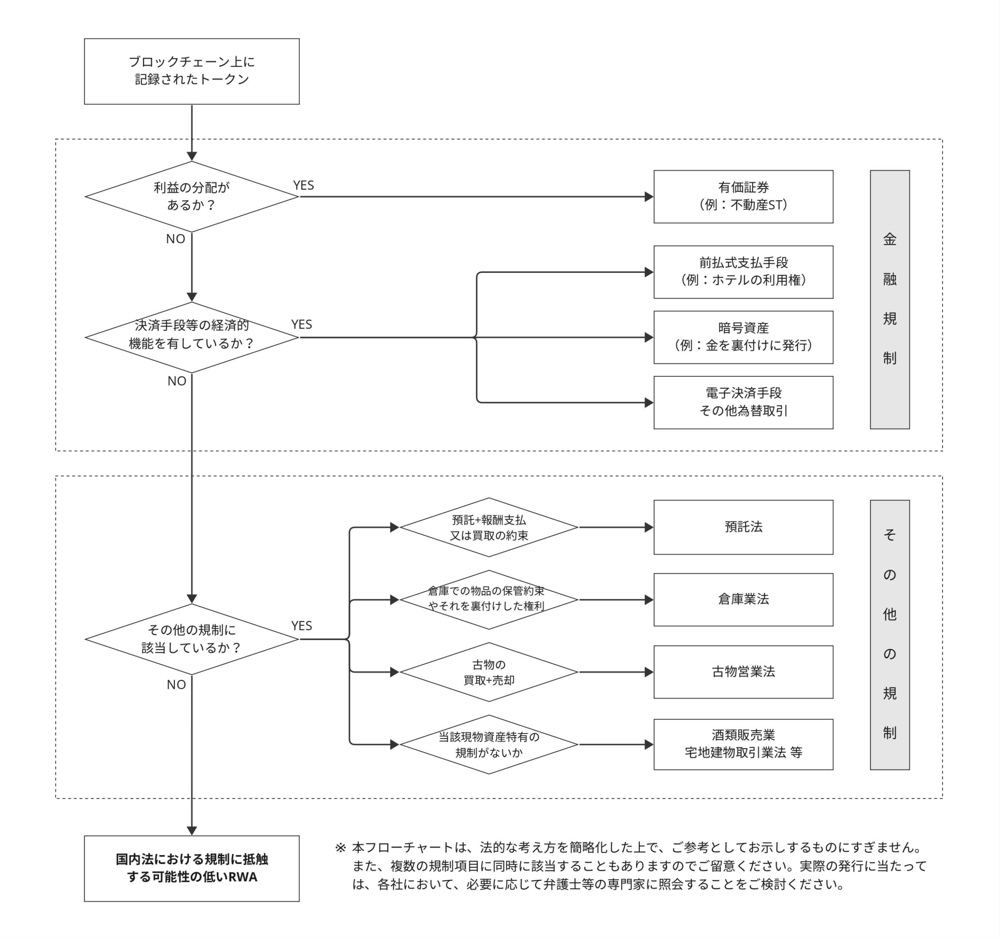

# RWAトークンを発行する上での主要な規制にかかる考え方

作成日時: 2024-04-04 02:40:46
更新日時: 2024-04-04 02:41:36

RWAトークンを発行する上での主要な規制にかかる考え方
[『RWAトークンを発行する上での主要な規制にかかる考え方』を公表 | 一般社団法人 日本暗号資産ビジネス協会（JCBA）](https://cryptocurrency-association.org/policy/20240404-001/)(https://cryptocurrency-association.org/policy/20240404-001/ 『RWAトークンを発行する上での主要な規制にかかる考え方』を公表 | 一般社団法人 日本暗号資産ビジネス協会（JCBA）)
[***** ]
