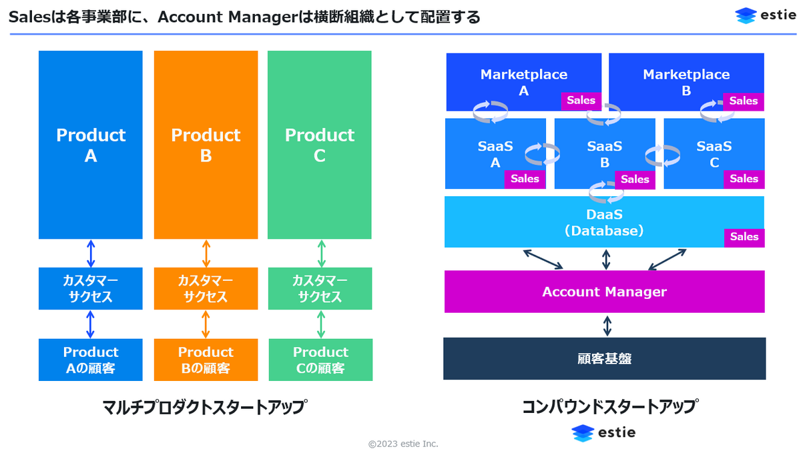
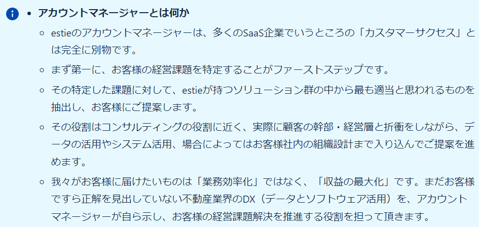
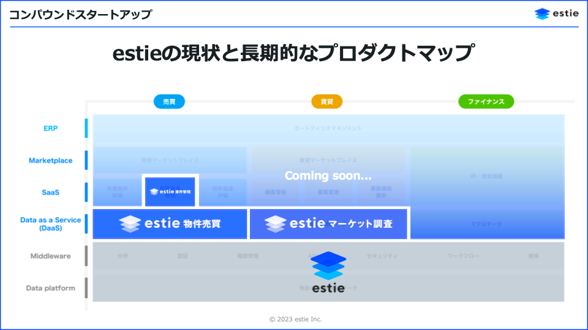

# estieのコンパウンド

作成日時: 2024-05-11 19:53:43
更新日時: 2024-05-11 21:17:22

estieのコンパウンド
[コンパウンドスタートアップに潜む矛盾と困難、その先に広がる世界 - estie inside blog](https://www.estie.jp/blog/entry/2023/11/10/115804)(https://www.estie.jp/blog/entry/2023/11/10/115804 コンパウンドスタートアップに潜む矛盾と困難、その先に広がる世界 - estie inside blog)
[6年間でゼロからデカコーンへ！ココがスゴいよ、Rippling！](https://blog.allstarsaas.com/posts/compound-rippling)(https://blog.allstarsaas.com/posts/compound-rippling 6年間でゼロからデカコーンへ！ココがスゴいよ、Rippling！)

[** バーティカルな領域でコンパウンドをやろうとするとどうなるか]

 各プロダクトには、プロダクトに特化したセールスが配置されるが、
 コンパウンドのプロダクトは、同一顧客へのクロスセルが中心となるため、プロダクトを横断して顧客の課題やビジョンに向き合う[* アカウントマネージャ]を配置している
 	
 		≒ [プロジェクトプロデューサー]
 

[** ホリゾンタルな領域でのコンパウンドとは]
そもそもコンパウンドは以下の課題に向き合っている
 verticalの単一ソリューションの提供はTAMの制約がある
 All-in-Oneや複数プロダクトの展開が必要になりやすい
 しかしマルチプロダクト戦略では、各プロダクトの機能（特に認証まわり）が重複し開発効率が悪い
 同一顧客にクロスセルするにも関わらずプロダクトごとに顧客データが分離していることで価値提供の効率が落ちる
[" コンパウンドが向き合っている課題と、ホリゾンタルは重ならないのでは？🤔]

